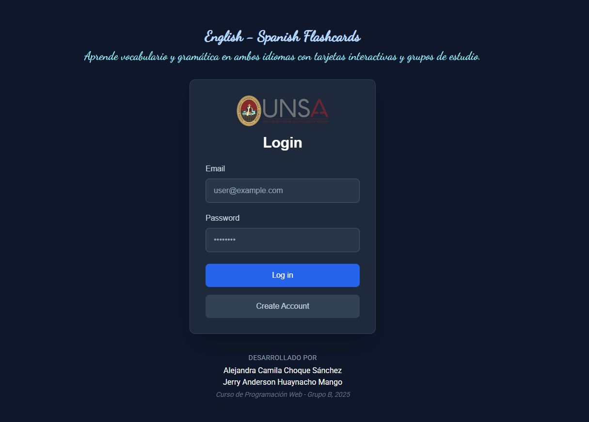

# Aplicación de Flashcards con React, Django y Supabase

## Autores

* Alejandra Camila Choque Sanchez
* Jerry Anderson Huaynacho Mango

---



---

## Descripción General

Esta aplicación web de **Flashcards** está diseñada para facilitar el aprendizaje a través de tarjetas educativas personalizadas. El frontend está desarrollado con **React** utilizando **TailwindCSS** para los estilos, mientras que el backend está implementado en **Django REST Framework** y conectado a una base de datos **PostgreSQL** desplegada mediante **Supabase**. La aplicación está completamente funcional en la nube, con el frontend desplegado en **Vercel** y el backend en **Render**.

## Tecnologías Utilizadas

### Frontend

* **React**: Biblioteca de JavaScript para construir interfaces de usuario.
* **TailwindCSS**: Framework de utilidades CSS para estilos responsivos y modernos.
* **React Router**: Para la navegación entre rutas protegidas y públicas.
* **Context API**: Manejo del estado global (usuarios, grupos de tarjetas).

### Backend

* **Django**: Framework de desarrollo web en Python.
* **Django REST Framework**: Para construir APIs RESTful.
* **Render**: Servicio de hosting para desplegar el backend de Django.

### Base de Datos

* **PostgreSQL**: Base de datos relacional robusta y escalable.
* **Supabase**: Servicio backend-as-a-service que ofrece autenticación, base de datos PostgreSQL y almacenamiento.

## Estructura del Proyecto

### Frontend

```plaintext
/frontend
├── public
│   └── index.html
├── src
│   ├── assets
│   │   └── logo.png
│   ├── components
│   │   ├── Navbar.jsx
│   │   ├── PrivateRoute.jsx
│   ├── context
│   │   ├── AuthContext.jsx
│   │   ├── GroupsContext.jsx
│   ├── pages
│   │   ├── Login.jsx
│   │   ├── Register.jsx
│   │   ├── Dashboard.jsx
│   │   ├── Profile.jsx
│   │   ├── Groups.jsx
│   │   ├── Create.jsx
│   │   ├── Flashcards.jsx
│   ├── App.jsx
│   ├── index.css
│   └── main.jsx
├── tailwind.config.js
├── postcss.config.js
├── vite.config.js
├── package.json
```

### Backend

```plaintext
/backend
├── manage.py
├── requirements.txt
├── flashcards_project
│   ├── __init__.py
│   ├── settings.py
│   ├── urls.py
│   ├── wsgi.py
│   └── asgi.py
├── api
│   ├── __init__.py
│   ├── admin.py
│   ├── apps.py
│   ├── models.py
│   ├── serializers.py
│   ├── views.py
│   ├── urls.py
│   └── permissions.py
```

El proyecto de Django está dividido en:

* `api`: contiene la lógica de negocio y exposición de los endpoints.
* `flashcards_project`: configuración global del proyecto, incluyendo CORS, conexión a Supabase/PostgreSQL, y JWT.

## Funcionalidades Principales

* Registro e inicio de sesión de usuarios
* Creación y administración de grupos de estudio
* Creación y estudio de flashcards
* Edición y eliminación de tarjetas
* Visualización personalizada por grupo
* Navegación protegida con rutas privadas

## Despliegue

### Frontend (Vercel)

El frontend fue desplegado en Vercel mediante integración continua desde GitHub. Se configuró el entorno para apuntar a los endpoints del backend en Render y a Supabase para la autenticación.

### Backend (Render)

El backend fue desplegado en Render utilizando un entorno Python 3.11. Se configuraron las variables de entorno, como `DATABASE_URL`, `SECRET_KEY`, y configuraciones CORS para habilitar la comunicación entre dominios.

### Base de Datos (Supabase)

Supabase se utilizó para gestionar la base de datos PostgreSQL y la autenticación. Se crearon tablas relacionadas con los usuarios, tarjetas y grupos, usando policies para restringir el acceso según el usuario logueado.

## Autenticación y Seguridad

* Tokens JWT (JSON Web Tokens) para manejo de sesiones
* Policies y RLS (Row-Level Security) en Supabase para proteger la información
* Middleware en Django para validar la autenticación

## Estilos y UI

* La interfaz fue diseñada con **TailwindCSS**, con un enfoque minimalista y responsive.
* La navegación incluye una **barra superior (Navbar)** que muestra el nombre de usuario y un botón de logout.
* Los formularios de inicio de sesión, registro y creación de tarjetas son accesibles y adaptables a móviles.

## Futuras Mejoras

* Integración de IA para generar tarjetas automáticamente a partir de texto
* Modo oscuro y preferencias de usuario
* Compartir grupos de tarjetas con otros usuarios
* Análisis de progreso del aprendizaje

## Capturas de Pantalla

* [ ] **Inicio de sesión** (imagen arriba)
* [ ] Dashboard con tarjetas recientes
* [ ] Vista de un grupo con sus flashcards
* [ ] Formulario para crear nueva tarjeta

## Licencia

Este proyecto es de uso académico y educativo.

---

> "Aprender es más fácil cuando se hace con estilo y tecnología."
